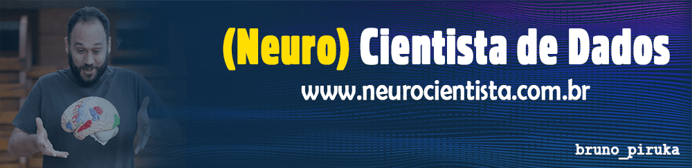

   

  

# Bruno Santos Souza
*Idealizador* do Site [neurocientista.com.br](https://www.neurocientista.com.br)

Apaixonado pelas ciências desde que se entende por gente. Até hoje uma "criança" curiosa, apesar de ter caminhado pela química e um meio mestrado em engenharia, foram as Neurociências que arrebataram esse coração! Pós-Graduado em Neuropsicologia Interdisciplinar. Inciando a jornada em Deep Learning, enquanto corre atrás de 3 crianças.

##### **Bacharel em Química pela UNESP-Araraquara │ Pós-graduado em Neuropsicologia Interdisciplinar │ Pai de 3**

**Interesses:** Python, Deep Learning, Cognitive Neuroscience e Natural Processing Language

**Links:**
* [Site](http://www.neuropsicologia.com.br)
* [LinkedIn](https://www.linkedin.com/in/brunopiruka)
* [Instagram](https://www.instagram.com/100_neura)
* [YouTube](https://www.youtube.com/100neura)

## Projetos:
Projetos Atuais:

* **Neuropsicologia Sem Neura:** http://www.neuropsicologia.com.br
* **Análise de Dados do AirBnb em São Francisco - CA** - http://abre.ai/bcJH
* **Análise da Violência na cidade do Rio de Janeiro** - http://abre.ai/bhbo
* **Análise da Evolução da COVID-19 no Brasil** - http://abre.ai/biC4
* **Modelo para Detecção de Fraude Financeira** - http://abre.ai/bjDX
* **Previsão de Evasão de Clientes (Churn Rate)** - http://abre.ai/bkf5
---

